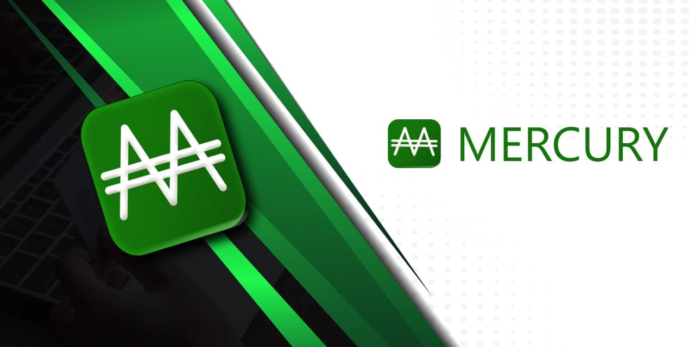

# Cardano Mercury for WooCommerce

Simple, reliable plugin to accept Cardano (Ada) payments for goods and services in WooCommerce.

**Version:** 1.0 
**Tags:** woocommerce, cardano, ada, lovelace, payment, gateway 
**Requires at least:** 5.7 
**Tested up to:** 5.7 
**Stable tag:** 1.0 
**Requires PHP:** 7.0 
**License:** GPLv3 
**License URI:** https://www.gnu.org/licenses/gpl-3.0.en.html

##Instructions and stuff coming soon!

This plugin is still considered to be in "beta" mode for the time being. Please use at your own risk although all testing
has shown to be reliable and work accurately there may still be bugs and issues that are encountered along the way.
Please use the GitHub issues tracker to submit any errors or issues you encounter. Please use the Discussions page for
feature and help requests.

##Credits

* Adam Dean (@crypto2099)

BUFFY Stakepool Owner/Operator Pool ID: [000022b3f0b748a43239c5024c58f852c05593cd0a77a798f0bb3a14](https://pooltool.io/pool/000022b3f0b748a43239c5024c58f852c05593cd0a77a798f0bb3a14)

* Latheesan Kanesamoorthy (@latheesan-k)

Special thanks to Latheesan Kanesamoorthy (@latheesan-k) for discussion, backend development, and much, much more! Thanks
to JP Birch (https://madinart.io) for the development of the Mercury logo and branding.

