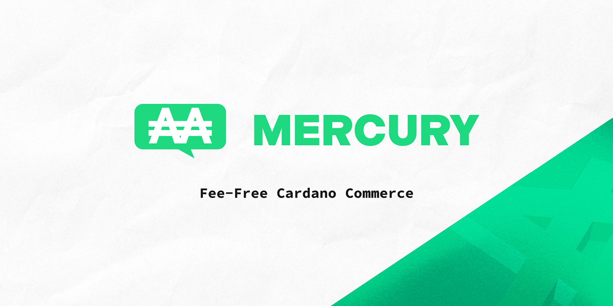

# Cardano Mercury for WooCommerce

A payment gateway plugin for [WooCommerce](https://woo.com) that enables seamless, fee-free payments in crypto via the
Cardano blockchain. Merchants may accept Cardano's native coin: ADA or any of the fungible Native Assets of their
choosing.

***

**Version:** 2.0-Beta 
**Tags:** woocommerce, wordpress, cardano, ada, lovelace, payment, gateway 
**Requires at least:** WooCommerce v8.5.2 
**Tested up to:** WooCommerce v8.5.2 
**Stable tag:** 1.0 
**Requires PHP:** 8.1.6 
**License:** GPLv3 
**License URI:** https://www.gnu.org/licenses/gpl-3.0.en.html

## Instructions and stuff coming soon!

This plugin is still considered to be in "beta" mode for the time being. Please use at your own risk. Although all
testing has shown to be reliable and work accurately there may still be bugs and issues that are encountered along the
way. Please use the GitHub issues tracker to submit any errors or issues you encounter. Please use the Discussions page
for feature and help requests.

## Version 2.0 Features and Improvements

Version 2.0 is currently in _Beta_ status as we do some further testing. 

Version 2 brings a variety of substantial improvements including:

* Support for CIP-30 light wallets to complete payment for an order by simply clicking a button and signing the
  transaction after the customer submits their order.
* Code refactoring for improved readability.
* Use of the new Action Scheduler for improved and more reliable monitoring of background tasks.
* Introduction of a lightweight custom database table to ensure that each order is given a unique value to help better
  identify individual payments.
* The first edition of this plugin did not support having greater than 100 UTxO present in the payment wallet due to
  pagination constraints by Blockfrost. Version 2.0 fixes this issue.
* Adding payment instructions to customer emails in addition to a link to return to the store to complete payment via
  CIP-30 enabled wallet.
* Removal of the QR-code generating package included in the first edition of this software. This should make the
  package size smaller and more easily transferable.
* Added ability to mark orders that were paid in $ADA as being manually refunded in the Orders interface for more
  accurate reporting for store owners.
* Support for merchants to accept any Cardano Native Asset that has a measurable price in ADA by leveraging an API
  connection to [TapTools](https://taptools.io).

## Credits

* Adam Dean GitHub: [@crypto2099](https://github.com/crypto2099) Twitter: [@adamkdean](https://twitter.com/adamkdean)

  Co-founder of Buffy Bot Publishing and [NFTxLV](https://nftxlv.com). Board of Directors for [DripDropz](https://dripdropz.io)

* Latheesan Kanesamoorthy GitHub: [@latheesan-k](https://github.com/latheesan-k)
  Twitter: [@LatheesanK](https://twitter.com/LatheesanK)

  Special thanks to Latheesan Kanesamoorthy (@latheesan-k) for discussion, backend development, and much, much more!

## Thanks

* Thanks to [JP Birch](https://twitter.com/jp_madnft) (MADinArt) for the development of the original Mercury logo and branding.
* Thanks to [Alessandro Konrad](https://github.com/alessandrokonrad) for his [Lucid](https://github.com/spacebudz/lucid)
  library which made integrating CIP-30 compliant wallets a breeze!
* Thanks to [CardanoScan](https://cardanoscan.io) for providing the best explorer in the Cardano ecosystem!
* Thanks to [Blockfrost](https://blockfrost.io) for providing a reliable API service in the Cardano ecosystem!
* Thanks to [Koios](https://koios.rest) for providing a _FREE_ API service in the Cardano ecosystem!
* Thanks to [TapTools](https://taptools.io) for the best Cardano Market Data API available!
* Thanks as always to the entire Cardano community for their support and encouragement.

